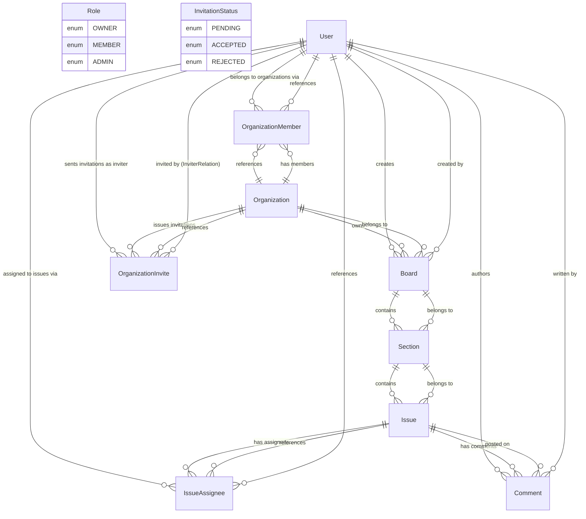

# Database Architecture & Schema Documentation

This document provides a comprehensive theoretical and technical overview of the Trello workspace database architecture, entity relationships, indexing strategies, primary key generation schemes, and domain models built with PostgreSQL and Prisma ORM.

---

## 1. Executive Summary & Architectural Overview

The backend uses **PostgreSQL** as its relational database management system, managed via **Prisma ORM**. The data model is designed to support a multi-tenant Trello-like project management application featuring organizations, members, invites, Kanban boards, drag-and-drop sections, issues, assignments, and nested comments.

### Key Architectural Characteristics
- **Primary Key Strategies**: 
  - **UUID (v4)**: Standard universally unique identifier used across root entity models (`User`, `Organization`, `Board`, `OrganizationMember`, `OrganizationInvite`, `IssueAssignee`, `Comment`).
  - **ULID (Universally Unique Lexicographical Sortable Identifier)**: Used for time-series / order-sensitive entities (`Section`, `Issue`) to allow natural chronological sorting while retaining high entropy and uniqueness.
- **Relational Integrity**: Foreign key constraints with explicit cascading deletes (`onDelete: Cascade`) to ensure zero orphan rows upon parent entity removal.
- **Index Optimization**: Comprehensive indexing strategy covering single-field foreign keys, unique slugs/emails/tokens, and composite indices for performance-critical queries (e.g., ordering sections and issues within parent containers).
- **Drag-and-Drop Order Optimization**: Floating-point `order` attributes (`Float`) on `Section` and `Issue` entities allow lightweight fractional index insertions during reordering operations without bulk updating neighboring rows.

---

## 2. Entity Relationship Diagram (ERD)

The diagram below maps all entity relations, cardinalities, foreign key references, and junction structures using standard Mermaid ER syntax.

---

## 3. Enumerated Types (Enums)

### `Role`
Defines permission tiers within an Organization.
- `OWNER`: Full administrative control, organization management, deletion, and billing permissions.
- `ADMIN`: Organizational management, board creation, member invitation, and section/issue oversight.
- `MEMBER`: General user privileges (viewing/editing assigned boards, creating/updating issues and comments).

### `InvitationStatus`
Lifecycle states for organization invitation tokens.
- `PENDING`: Invitation issued but not yet accepted or rejected.
- `ACCEPTED`: Invitee accepted the invitation; membership created.
- `REJECTED`: Invitee declined the invitation.

---

## 4. Entity Deep-Dive & Field Specifications

### 4.1. User (`users`)
Represents an individual platform user with authentication credentials and relational links to organizations, boards, issues, and comments.

| Field | Type | Attributes / Constraints | Description |
| :--- | :--- | :--- | :--- |
| `id` | `String` | `@id @default(uuid())` | Primary Key (UUIDv4) |
| `email` | `String` | `@unique` | Unique login email identifier |
| `name` | `String?` | Optional | Display name of the user |
| `passwordHash` | `String` | Required | Hashed user password |
| `avatarUrl` | `String?` | Optional | URL to user's profile avatar image |
| `createdAt` | `DateTime` | `@default(now())` | Record creation timestamp |
| `updatedAt` | `DateTime` | `@updatedAt` | Auto-updating modification timestamp |

- **Indices**:
  - `@@index([email])` for fast lookup during login/authentication.
- **Relational Integrity**:
  - `comments`: One-to-Many relation with `Comment`.
  - `createdBoards`: One-to-Many relation with `Board`.
  - `sentInvites`: One-to-Many relation with `OrganizationInvite` (`InviterRelation`).
  - `assignedIssues`: One-to-Many relation with `IssueAssignee` junction model.
  - `memberships`: One-to-Many relation with `OrganizationMember` junction model.

---

### 4.2. Organization (`organizations`)
Represents a top-level organization / tenant containing members, boards, and invites.

| Field | Type | Attributes / Constraints | Description |
| :--- | :--- | :--- | :--- |
| `id` | `String` | `@id @default(uuid())` | Primary Key (UUIDv4) |
| `name` | `String` | Required | Name of the organization |
| `slug` | `String` | `@unique` | Unique URL-friendly slug for routing |
| `description` | `String?` | Optional | Rich summary of organization purpose |
| `avatarUrl` | `String?` | Optional | Organization logo / emblem URL |
| `createdAt` | `DateTime` | `@default(now())` | Creation timestamp |
| `updatedAt` | `DateTime` | `@updatedAt` | Last updated timestamp |

- **Indices**:
  - `@@index([slug])` for quick workspace resolution by URL slug.
- **Relational Integrity**:
  - `members`: One-to-Many relation with `OrganizationMember`.
  - `boards`: One-to-Many relation with `Board`.
  - `invites`: One-to-Many relation with `OrganizationInvite`.

---

### 4.3. OrganizationMember (`organization_members`)
Junction model establishing a Many-to-Many relation between `User` and `Organization` with role payload data.

| Field | Type | Attributes / Constraints | Description |
| :--- | :--- | :--- | :--- |
| `id` | `String` | `@id @default(uuid())` | Primary Key (UUIDv4) |
| `userId` | `String` | Foreign Key (`User.id`) | Foreign key linking to `User` |
| `organizationId` | `String` | Foreign Key (`Organization.id`) | Foreign key linking to `Organization` |
| `role` | `Role` | `@default(MEMBER)` | Member privilege level |
| `createdAt` | `DateTime` | `@default(now())` | Joining timestamp |
| `updatedAt` | `DateTime` | `@updatedAt` | Role update timestamp |

- **Constraints & Indices**:
  - `@@unique([userId, organizationId])`: Ensures a user cannot join the same organization multiple times.
  - `@@index([userId])` & `@@index([organizationId])`: Fast lookups for user organizations and organization member lists.
- **Cascading Policy**:
  - `userId` -> `User.id` (`onDelete: Cascade`)
  - `organizationId` -> `Organization.id` (`onDelete: Cascade`)

---

### 4.4. OrganizationInvite (`organization_invites`)
Manages pending invitations sent to potential members via unique tokens.

| Field | Type | Attributes / Constraints | Description |
| :--- | :--- | :--- | :--- |
| `id` | `String` | `@id @default(uuid())` | Primary Key (UUIDv4) |
| `email` | `String` | Required | Invitee recipient email |
| `organizationId` | `String` | Foreign Key (`Organization.id`) | Target organization |
| `inviterId` | `String` | Foreign Key (`User.id`) | User issuing the invite |
| `status` | `InvitationStatus` | `@default(PENDING)` | Current invitation state |
| `token` | `String` | `@unique` | Secure invitation redemption token |
| `expiresAt` | `DateTime` | Required | Expiration deadline |
| `createdAt` | `DateTime` | `@default(now())` | Issuance timestamp |

- **Indices**:
  - `@@index([email])`, `@@index([organizationId])`, `@@index([inviterId])`, `@@index([token])` for fast verification and listing.
- **Cascading Policy**:
  - `organizationId` -> `Organization.id` (`onDelete: Cascade`)
  - `inviterId` -> `User.id` (`onDelete: Cascade`)

---

### 4.5. Board (`boards`)
Kanban board container belonging to an Organization and authored by a User.

| Field | Type | Attributes / Constraints | Description |
| :--- | :--- | :--- | :--- |
| `id` | `String` | `@id @default(uuid())` | Primary Key (UUIDv4) |
| `title` | `String` | Required | Board title |
| `backgroundColor` | `String` | Required | Color theme / hex code |
| `isClosed` | `Boolean` | `@default(false)` | Archival status flag |
| `organizationId` | `String` | Foreign Key (`Organization.id`) | Owning organization |
| `creatorId` | `String` | Foreign Key (`User.id`) | Authoring user |
| `createdAt` | `DateTime` | `@default(now())` | Board creation timestamp |
| `updatedAt` | `DateTime` | `@updatedAt` | Last modified timestamp |

- **Indices**:
  - `@@index([organizationId])`, `@@index([creatorId])`
- **Cascading Policy**:
  - `organizationId` -> `Organization.id` (`onDelete: Cascade`)
  - `creatorId` -> `User.id` (`onDelete: Cascade`)

---

### 4.6. Section (`sections`)
Represents a column (e.g. "To Do", "In Progress", "Done") inside a Kanban board.

| Field | Type | Attributes / Constraints | Description |
| :--- | :--- | :--- | :--- |
| `id` | `String` | `@id @default(ulid())` | Primary Key (ULID for sorting) |
| `title` | `String` | Required | Section title |
| `order` | `Float` | Required | Floating point position for sorting |
| `boardId` | `String` | Foreign Key (`Board.id`) | Owning board |
| `createdAt` | `DateTime` | `@default(now())` | Creation timestamp |
| `updatedAt` | `DateTime` | `@updatedAt` | Modification timestamp |

- **Indices**:
  - `@@index([boardId, order])`: Composite index optimizes sorted section listing per board (`SELECT * FROM sections WHERE boardId = ? ORDER BY order ASC`).
- **Cascading Policy**:
  - `boardId` -> `Board.id` (`onDelete: Cascade`)

---

### 4.7. Issue (`issues`)
Represents a task card placed inside a board section.

| Field | Type | Attributes / Constraints | Description |
| :--- | :--- | :--- | :--- |
| `id` | `String` | `@id @default(ulid())` | Primary Key (ULID) |
| `title` | `String` | Required | Card summary / title |
| `description` | `String?` | `@db.Text` | Detailed Markdown/Text body |
| `order` | `Float` | Required | Position within section |
| `dueDate` | `DateTime?` | Optional | Task deadline |
| `sectionId` | `String` | Foreign Key (`Section.id`) | Containing section |
| `createdAt` | `DateTime` | `@default(now())` | Issue creation timestamp |
| `updatedAt` | `DateTime` | `@updatedAt` | Modification timestamp |

- **Indices**:
  - `@@index([sectionId, order])`: Composite index optimizing ordered issue fetches inside a section.
- **Cascading Policy**:
  - `sectionId` -> `Section.id` (`onDelete: Cascade`)

---

### 4.8. IssueAssignee (`issue_assignees`)
Junction model enabling Many-to-Many assignments between Users and Issues.

| Field | Type | Attributes / Constraints | Description |
| :--- | :--- | :--- | :--- |
| `id` | `String` | `@id @default(uuid())` | Primary Key (UUIDv4) |
| `issueId` | `String` | Foreign Key (`Issue.id`) | Targeted issue |
| `userId` | `String` | Foreign Key (`User.id`) | Assigned user |

- **Constraints & Indices**:
  - `@@unique([issueId, userId])`: Prevents assigning the same user twice to an issue.
  - `@@index([issueId])`, `@@index([userId])`: Quick lookup for issue assignees or user assignments.
- **Cascading Policy**:
  - `issueId` -> `Issue.id` (`onDelete: Cascade`)
  - `userId` -> `User.id` (`onDelete: Cascade`)

---

### 4.9. Comment (`comments`)
Discussion entries left by users on specific issues.

| Field | Type | Attributes / Constraints | Description |
| :--- | :--- | :--- | :--- |
| `id` | `String` | `@id @default(uuid())` | Primary Key (UUIDv4) |
| `content` | `String` | `@db.Text` | Comment body content |
| `issueId` | `String` | Foreign Key (`Issue.id`) | Associated issue |
| `userId` | `String` | Foreign Key (`User.id`) | Comment author |
| `createdAt` | `DateTime` | `@default(now())` | Comment creation timestamp |
| `updatedAt` | `DateTime` | `@updatedAt` | Modification timestamp |

- **Indices**:
  - `@@index([issueId])`, `@@index([userId])`
- **Cascading Policy**:
  - `issueId` -> `Issue.id` (`onDelete: Cascade`)
  - `userId` -> `User.id` (`onDelete: Cascade`)

---

## 5. Theoretical Database Design Patterns & Best Practices Applied

1. **Third Normal Form (3NF) Compliance**:
   - Entities strictly adhere to 3NF. Transitive dependencies are removed (e.g. member roles live in `OrganizationMember` rather than duplicating user/org columns elsewhere).
2. **Fractional Indexing for Reordering**:
   - Using `Float` for `order` columns on `Section` and `Issue` enables insertion between existing items by computing average value: $order_{new} = \frac{order_{prev} + order_{next}}{2}$. This converts $O(N)$ row updates into an $O(1)$ single row update during drag-and-drop operations.
3. **Cascading Referential Integrity**:
   - Every foreign key constraint declares `onDelete: Cascade`. Removing an `Organization` automatically cleans up all associated `OrganizationMember` records, `Board` instances, `Section`s, `Issue`s, `IssueAssignee`s, and `Comment`s without dangling foreign key violations.
4. **Primary Key Optimization (UUID vs ULID)**:
   - **UUIDv4**: Provides standard 128-bit randomness for non-sequential entities where security through obscurity and identifier unpredictability is desirable (`User`, `Organization`, `Board`).
   - **ULID**: Lexicographically sortable 128-bit identifiers containing a 48-bit timestamp prefix. Ideal for `Section` and `Issue` tables to maintain write-performance and indexing locality on high-frequency insertion tables.
5. **Mapped Database Naming Conventions**:
   - Prisma models use PascalCase (`OrganizationMember`), but explicitly map to snake_case table names (`@@map("organization_members")`) aligning with PostgreSQL database conventions.
