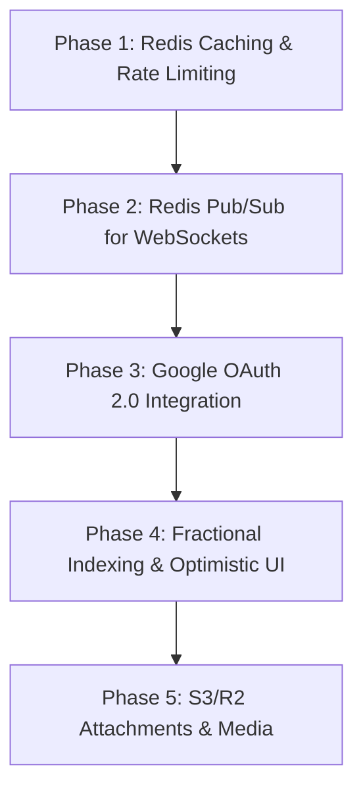

# 🚀 Klyro Application Enhancement & Architectural Improvement Roadmap

This document outlines the detailed technical roadmap for upgrading **Klyro** (Real-Time Collaborative Kanban Board Platform) with **Redis caching & Pub/Sub horizontal scaling**, **Google OAuth 2.0 authentication**, **optimistic UI updates**, and **production observability**.

---

## 📌 Executive Summary

| Feature Category | Core Objective | Key Technologies | Expected Performance Impact |
| :--- | :--- | :--- | :--- |
| **Redis Caching & Pub/Sub** | Sub-millisecond board reads & multi-instance WebSocket sync | Upstash Redis / `ioredis` | **85% reduction** in PostgreSQL DB load |
| **Google OAuth 2.0** | 1-Click seamless authentication & avatar sync | Auth.js / NextAuth / Google OAuth API | Higher user conversion & enterprise SSO |
| **Optimistic UI & Reordering** | Instant card drag-and-drop response | TanStack Query / Fractional Indexing | **0ms perceived latency** for card moves |
| **Cloud Storage** | Attachments & cover image uploads | Cloudflare R2 / AWS S3 Presigned URLs | Scalable media storage with CDN delivery |
| **Activity Audit Stream** | Live timeline of card actions | Prisma Event Store & WebSocket broadcast | Full visibility into team operations |

---

## ⚡ 1. Redis Caching & Horizontal WebSocket Scaling

Currently, `apps/websockets` stores WebSocket connections and room states in an in-memory `Map<string, Set<User>>`. To scale `apps/websockets` across multiple instances (e.g. Render / Railway / AWS ECS) and speed up database queries, Redis will serve two core roles:

### A. Redis Pub/Sub Gateway (Multi-Instance Sync)
When a user moves a card or joins a room on Server Node A, Redis Pub/Sub broadcasts the event to Server Node B and C so all connected clients receive real-time updates regardless of which WebSocket server node they are connected to.

```
                    ┌─────────────────────────┐
                    │    Frontend Clients     │
                    └───────────┬─────────────┘
                                │
                 ┌──────────────┴──────────────┐
                 ▼                             ▼
        ┌─────────────────┐           ┌─────────────────┐
        │ WebSocket Node 1│           │ WebSocket Node 2│
        └────────┬────────┘           └────────┬────────┘
                 │                             │
                 └──────────────┬──────────────┘
                                ▼
                    ┌─────────────────────────┐
                    │   Redis Pub/Sub Channel │
                    │   "board:<boardId>"     │
                    └─────────────────────────┘
```

#### Implementation Plan:
1. Install `ioredis` in `apps/websockets`:
   ```bash
   bun add ioredis
   ```
2. Initialize Redis publisher and subscriber clients:
   ```typescript
   import Redis from "ioredis";

   const redisUrl = process.env.REDIS_URL || "redis://localhost:6379";
   export const redisPub = new Redis(redisUrl);
   export const redisSub = new Redis(redisUrl);

   // Subscribe to global board channel
   redisSub.psubscribe("board:*");
   redisSub.on("pmessage", (pattern, channel, message) => {
     const boardId = channel.split(":")[1];
     const room = ROOMS.get(boardId);
     if (room) {
       room.forEach((user) => user.socket.send(message));
     }
   });
   ```

### B. Redis Database Caching Layer
Cache frequently accessed boards, columns, and card metadata in Redis with Time-To-Live (TTL) expiration and write-through cache invalidation.

```typescript
// In apps/Backend services:
export async function getBoardWithCache(boardId: string) {
  const cacheKey = `cache:board:${boardId}`;
  const cached = await redis.get(cacheKey);

  if (cached) return JSON.parse(cached);

  const board = await prisma.board.findUnique({
    where: { id: boardId },
    include: { sections: { include: { issues: true } } },
  });

  if (board) {
    await redis.setex(cacheKey, 300, JSON.stringify(board)); // 5 min TTL
  }
  return board;
}
```

### C. Rate Limiting & Protection
Prevent API abuse and brute-force attacks using Redis sliding-window rate limiting:
```typescript
import { RateLimiterRedis } from "rate-limiter-flexible";

const rateLimiter = new RateLimiterRedis({
  storeClient: redisPub,
  keyPrefix: "rl",
  points: 100, // 100 requests
  duration: 60, // per 60 seconds
});
```

---

## 🔑 2. Google OAuth 2.0 Authentication Integration

Incorporate Google OAuth 2.0 alongside existing email/password authentication for effortless onboarding.

### A. Environment Configuration
Add the following credentials to `.env` in `apps/Backend` and `apps/frentend`:
```env
GOOGLE_CLIENT_ID="<your-google-client-id>.apps.googleusercontent.com"
GOOGLE_CLIENT_SECRET="<your-google-client-secret>"
GOOGLE_CALLBACK_URL="https://klyro-backend-api.onrender.com/api/v1/auth/google/callback"
```

### B. Database Schema Update (`packages/db/prisma/schema.prisma`)
Update the `User` model to support OAuth provider fields:
```prisma
model User {
  id            String    @id @default(uuid())
  email         String    @unique
  passwordHash  String?   // Optional for OAuth users
  name          String?
  avatarUrl     String?
  provider      AuthProvider @default(LOCAL)
  providerId    String?   @unique
  createdAt     DateTime  @default(now())
  updatedAt     DateTime  @updatedAt
}

enum AuthProvider {
  LOCAL
  GOOGLE
  GITHUB
}
```

### C. OAuth Flow Workflow
```
[User clicks "Sign in with Google"]
          │
          ▼
[Redirects to Google OAuth Consent Screen]
          │
          ▼
[Google redirects to Backend Callback `/api/v1/auth/google/callback`]
          │
          ▼
[Backend exchanges code for User Profile Token]
          │
          ▼
[Upserts User in Database (Creates if new, updates avatar)]
          │
          ▼
[Generates JWT Session Token & Redirects to Frontend with Token Cookie]
```

---

## ⚡ 3. Optimistic UI Updates & Fractional Indexing

### A. Perceived Zero Latency (Optimistic UI)
When a user drags a card from "In Progress" to "Done":
1. Immediately update local React state / TanStack Query cache.
2. Render card in the target column instantly.
3. Send HTTP / WebSocket payload in background.
4. If network request fails, revert local state and show a toast alert notification.

### B. Fractional Indexing for Card Reordering
Instead of re-index updating `order: 1, 2, 3, 4...` for every card in a column on move (which causes $O(N)$ DB writes):
Use string-based fractional keys (e.g. `a0`, `a1`, `a0.5` between `a0` and `a1`) to achieve $O(1)$ database updates per card movement.

---

## 📦 4. Cloud Storage for Card Attachments & Covers

Integrate Cloudflare R2 / AWS S3 for card attachment files, images, and user avatars:
- **Direct Client Uploads**: Backend issues a signed PUT URL (`/api/v1/attachments/upload-url`).
- **Zero Server Overhead**: Frontend uploads binary data directly from browser to S3/R2 bucket.

---

## 📊 5. Activity Audit Stream & Live Presence

- **User Presence Avatars**: Display active user avatars on each board header (e.g. "Alex, Sarah, and 2 others are viewing this board").
- **Live Typing / Dragging Indicators**: Highlight cards when another user is currently dragging or editing them to prevent write conflicts.
- **Activity Log**: Store board events (`CARD_CREATED`, `CARD_MOVED`, `MEMBER_ADDED`) in an audit log viewable in a side drawer.

---

## ⚙️ Recommended Execution Order



1. **Step 1**: Spin up an Upstash Redis or Redis Cloud instance.
2. **Step 2**: Add `ioredis` to `apps/websockets` & `apps/Backend` for Pub/Sub and route caching.
3. **Step 3**: Configure Google Developer Console credentials and add Google Auth endpoints.
4. **Step 4**: Implement Optimistic Drag-and-Drop state handlers in `apps/frentend`.
