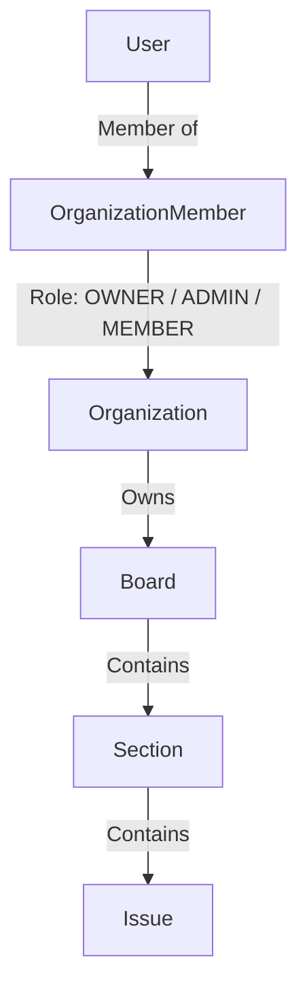

# Backend Architecture & First-Principles Design Specification

This document provides a foundational, first-principles architectural breakdown of the Trello backend service (`apps/Backend`). It explains *why* every abstraction, layer, data flow, and pattern exists in the system.

---

## 🧬 1. First-Principles Deconstruction

### What is the Core Purpose of this Backend?
At its fundamental level, a project management platform (like Trello) is a **state machine for multi-tenant collaborative task tracking**.

To fulfill this purpose, the backend must solve five fundamental problems:
1. **Identity & Authentication**: How do we safely verify who a user is without storing state on the server?
2. **Multi-Tenant Isolation**: How do we ensure User A cannot access or mutate Organization B's data?
3. **Role-Based Access Control (RBAC)**: How do we enforce different permission levels (Owner, Admin, Member)?
4. **Data Consistency & Atomicity**: How do we guarantee that multi-step operations (e.g. creating an organization + assigning owner membership) never leave orphaned data?
5. **Fractional Reordering**: How do we move tasks and lists around efficiently without triggering $O(N)$ database updates?

---

## 🏛️ 2. Architectural Layers & Separation of Concerns

The backend follows a **Decoupled 4-Tier Layered Architecture**:

```
 ┌─────────────────────────────────────────────────────────┐
 │                   Express HTTP Server                   │ (Transport Layer)
 └────────────────────────────┬────────────────────────────┘
                              │
 ┌────────────────────────────▼────────────────────────────┐
 │              Route Middlewares & Zod Schemas            │ (Validation & Auth)
 └────────────────────────────┬────────────────────────────┘
                              │
 ┌────────────────────────────▼────────────────────────────┘
 │                  Controller Layer                       │ (HTTP Request Handler)
 └────────────────────────────┬────────────────────────────┘
                              │
 ┌────────────────────────────▼────────────────────────────┘
 │                   Service Layer                         │ (Business Domain Logic)
 └────────────────────────────┬────────────────────────────┘
                              │
 ┌────────────────────────────▼────────────────────────────┘
 │                Prisma ORM & PostgreSQL                  │ (Persistence Layer)
 └─────────────────────────────────────────────────────────┘
```

### Layer Responsibilities:

1. **Transport & Middleware Layer (`src/index.ts`, `src/middlewares/`)**:
   - `express.json()` parses HTTP payload.
   - `pino-http` injects clean request/response logging.
   - `authenticateToken` extracts JWT Bearer tokens, verifies cryptographic signature using `VERIFY_TOKEN`, and attaches `req.user = { userId, email }`.

2. **Validation & Routing Layer (`src/models/`, `src/routes/`)**:
   - Zod schemas (`SignupSchema`, `CreateOrgSchema`, `CreateInviteSchema`) validate incoming JSON inputs before any business logic executes.
   - Standardized 400 Bad Request error responses are returned if validation fails, preventing dirty data from hitting services.

3. **Controller Layer (`src/controllers/`)**:
   - Translates HTTP inputs (`req.params`, `req.body`, `req.user`) into service calls.
   - Maps service results and caught exceptions into standardized JSON responses:
     - `200 OK` / `201 Created` on success.
     - `400 Bad Request`, `401 Unauthorized`, `403 Forbidden`, `409 Conflict`, `500 Internal Server Error` on failure.

4. **Service Layer (`src/services/`)**:
   - Houses pure business logic independent of HTTP controllers.
   - Enforces RBAC permissions (`OWNER` vs `ADMIN` vs `MEMBER`).
   - Executes atomic Prisma database transactions (`prisma.$transaction`).

5. **Persistence Layer (`db/client`)**:
   - Managed via PostgreSQL with Prisma ORM adapter.
   - All relations specify `onDelete: Cascade` to ensure referential integrity.

---

## 🔑 3. Identity, Security & Token Fundamentals

### 3.1 Password Hashing (Argon2id)
- Passwords are never stored in plain text. Passwords are hashed using `Bun.password.hash(password, { algorithm: "argon2id" })`.
- Argon2id provides state-of-the-art resistance against side-channel and GPU-based brute-force attacks.

### 3.2 Dynamic Secret Resolution JWT
Tokens are signed with `Generate_token({ userId, email })` and verified with `VERIFY_TOKEN(token)`.
- **Dynamic Secret Access**: Secret resolution uses `getJwtSecret = () => process.env.JWT_SECRET || "default-secret"`.
- This avoids ESM static import hoisting bugs where top-level environment variables might be uninitialized during module evaluation.

---

## 🛡️ 4. Multi-Tenancy & Authorization Model

Every resource in the system derives its permission boundary from an **Organization**:



### Permission Enforcement Rules:
1. **Creating Organization**: Any authenticated user can create an organization. The creator is atomically assigned `role: "OWNER"` in `OrganizationMember`.
2. **Deleting Organization**: Only members with `role: "OWNER"` can delete the organization.
3. **Inviting Members**: Only members with `role: "OWNER"` or `role: "ADMIN"` can generate invite tokens.
4. **Removing Members**:
   - An `OWNER` can remove any member.
   - An `ADMIN` can remove `MEMBER`s.
   - Any user can remove themselves (leave organization).

---

## 📊 5. Data Structures & Primary Key Strategy

| Primitive | Entity Types | Rationale (First Principles) |
| :--- | :--- | :--- |
| **UUIDv4** | `User`, `Organization`, `Board`, `OrganizationMember`, `OrganizationInvite`, `IssueAssignee`, `Comment` | Provides unpredictable, non-sequential 128-bit identifiers preventing enumeration attacks across public IDs. |
| **ULID** | `Section`, `Issue` | Lexicographically sortable 128-bit IDs containing a 48-bit millisecond timestamp. Guarantees index locality for high-frequency write operations while maintaining unique sorting capabilities. |
| **Float (`order`)** | `Section.order`, `Issue.order` | Enables **Fractional Indexing** for drag-and-drop. Moving an item between position $A$ and position $B$ sets $order_{new} = \frac{order_A + order_B}{2}$, avoiding $O(N)$ re-indexing of all surrounding rows. |

---

## 🔄 6. Error Handling & Standardized Response Contract

All API endpoints return JSON conforming strictly to the platform response contract:

### Success Response (`200 OK` / `201 Created`):
```json
{
  "success": true,
  "data": { ... }
}
```

### Error Response (`4xx` / `5xx`):
```json
{
  "success": false,
  "error": {
    "code": "UNAUTHORIZED" | "FORBIDDEN" | "BAD_REQUEST" | "NOT_FOUND" | "CONFLICT" | "INTERNAL_SERVER_ERROR",
    "message": "Human-readable explanation of error",
    "details": { ... }
  }
}
```
